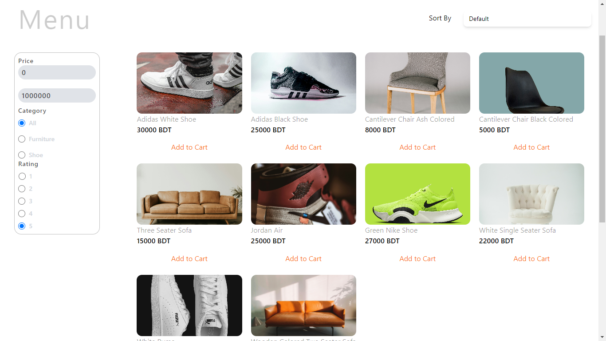
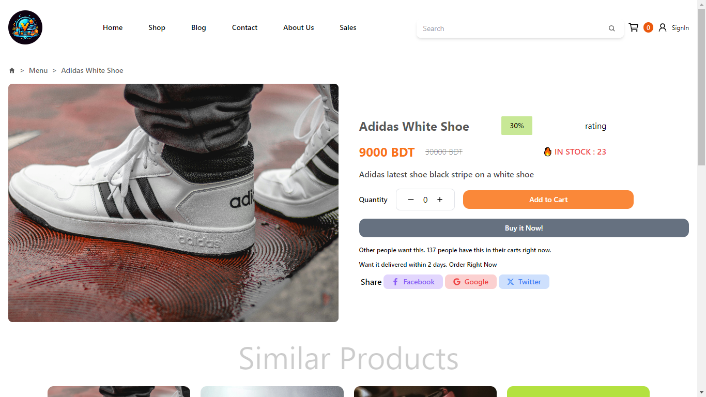
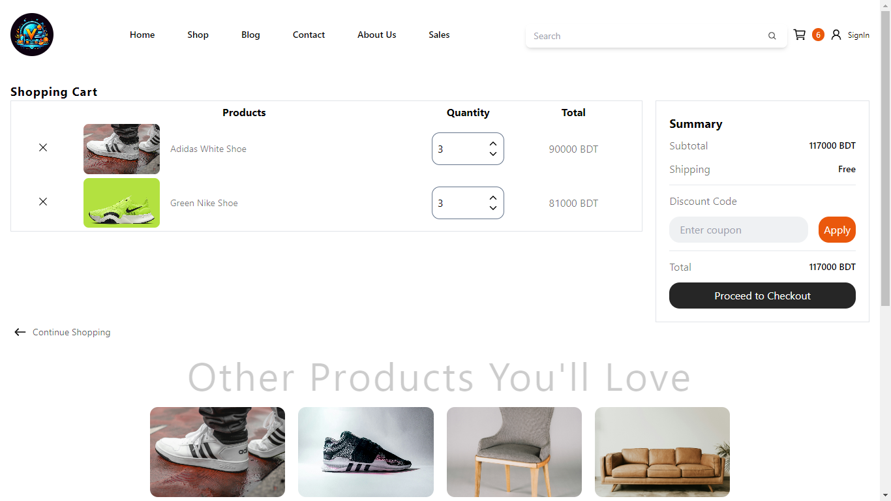
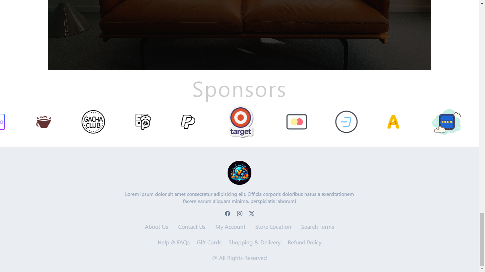

# VividVentures

Welcome to VividVentures, an innovative e-commerce platform built on cutting-edge technologies to provide users with a seamless and engaging shopping experience. Our platform leverages the power of React, Framer Motion, MongoDB, Mongoose, Express.js, Redux Toolkit, Stripe, and Tailwind CSS to create a robust and feature-rich online shopping environment.

### Frameworks I worked with

This app is built on seven frameworks that are shown below.

- [![React][React]][ReactUrl]
- [![ExpressJsUrl][ExpressJs]][ExpressJsUrl]
- [![MongoDB][MongoDB]][MongoDBUrl]
- [![NodeJs][NodeJs]][NodeJsUrl]
- [![ReactRouter][ReactRouter]][ReactRouterUrl]
- [![ReduxToolkit][ReduxToolkit]][ReduxToolkitUrl]
- [![Stripe][Stripe Badge]][StripeUrl]
- [![Framer Badge][FramerMotion]][FramerBadgeUrl]
- [![TailwindCss][Tailwind]][TailwindUrl]

### Live Demonstration

VividVentures is live here [Project](https://vivid-ventures-iota.vercel.app/)

Here are the screenshots of the VividVentures Website

**Home Page**


---

**Menu Page**


---

**Single Product Page**


---

**Shopping Cart**


---

**Sponsor and Footer**


## Getting Started

To get started you can simply clone this `VividVentures` repository and install the dependencies.

Clone the `VividVentures` repository using git:

```bash
git clone https://github.com/faiyaj7/VividVentures
cd VividVentures
```

Install dependencies with this command:

```bash
npm install
```

Run the application with this command:

```bash
npm start
```

[React]: https://img.shields.io/badge/React-20232A?style=for-the-badge&logo=react&logoColor=61DAFB
[ReactUrl]: https://reactjs.org/
[ExpressJs]: https://img.shields.io/badge/express.js-%23404d59.svg?style=for-the-badge&logo=express&logoColor=%2361DAFB
[ExpressJsUrl]: https://expressjs.com/
[MongoDB]: https://img.shields.io/badge/MongoDB-%234ea94b.svg?style=for-the-badge&logo=mongodb&logoColor=white/
[MongoDBUrl]: https://www.mongodb.com/atlas/database
[NodeJs]: https://img.shields.io/badge/node.js-6DA55F?style=for-the-badge&logo=node.js&logoColor=white
[NodeJsUrl]: https://nodejs.org/en
[ReactRouter]: https://img.shields.io/badge/React_Router-CA4245?style=for-the-badge&logo=react-router&logoColor=white
[ReactRouterUrl]: https://reactrouter.com/en/main
[ReduxToolkit]: https://img.shields.io/badge/redux-%23593d88.svg?style=for-the-badge&logo=redux&logoColor=white
[ReduxToolkitUrl]: https://redux-toolkit.js.org/introduction/getting-started
[Stripe Badge]: https://img.shields.io/badge/Stripe-008CDD?logo=stripe&logoColor=fff&style=plastic
[StripeUrl]: https://stripe.com/
[FramerMotion]: https://img.shields.io/badge/Framer-05F?logo=framer&logoColor=fff&style=flat-square
[FramerBadgeUrl]: https://www.framer.com/motion/
[Tailwind]: https://img.shields.io/badge/tailwindcss-%2338B2AC.svg?style=for-the-badge&logo=tailwind-css&logoColor=white
[TailwindUrl]: https://tailwindcss.com
